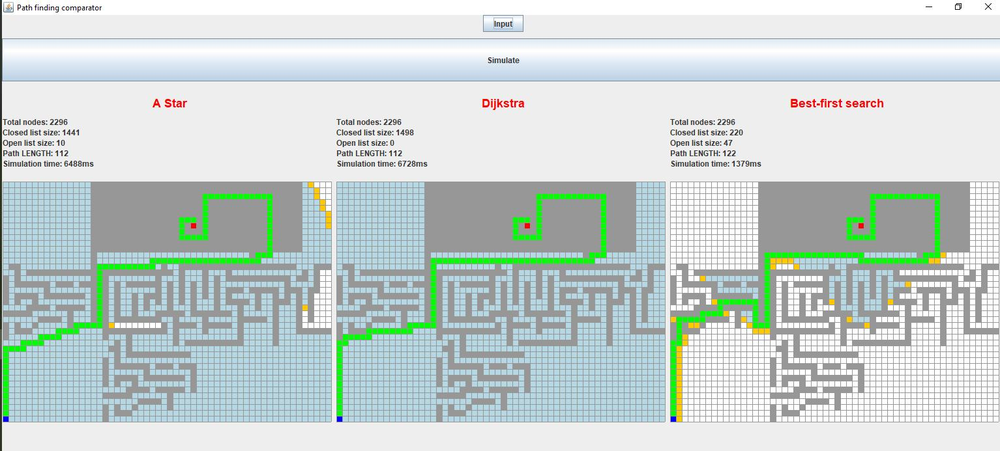

# AStarDemo
- Execute the src/Main.java, and the main form is shown with default Map.inp is opened
- We offer the map structure as follows:
<height> <width> <src_row> <src_col> <dst_row> <dst_col> (row, col are 0-based index)
<map_content, with 1 indicates walls>

## The screenshot


## How to create a map ?
Example:
Here is the map with 41 row and 56 cols (as the above screenshot), where agent starts from (40, 0) to reach (7, 32)
```
41 56 40 0 7 32
0	0	0	0	0	0	0	0	0	0	0	0	0	0	0	1	1	1	1	1	1	1	1	1	1	1	1	1	1	1	1	1	1	1	1	1	1	1	1	1	1	1	1	1	1	1	1	1	1	1	1	0	0	0	0	0
0	0	0	0	0	0	0	0	0	0	0	0	0	0	0	1	1	1	1	1	1	1	1	1	1	1	1	1	1	1	1	1	1	1	1	1	1	1	1	1	1	1	1	1	1	1	1	1	1	1	1	0	0	0	0	0
0	0	0	0	0	0	0	0	0	0	0	0	0	0	0	1	1	1	1	1	1	1	1	1	1	1	1	1	1	1	1	1	1	1	0	0	0	0	0	0	0	0	0	0	0	0	1	1	1	1	1	0	0	0	0	0
0	0	0	0	0	0	0	0	0	0	0	0	0	0	0	1	1	1	1	1	1	1	1	1	1	1	1	1	1	1	1	1	1	1	0	1	1	1	1	1	1	1	1	1	1	0	1	1	1	1	1	0	0	0	0	0
0	0	0	0	0	0	0	0	0	0	0	0	0	0	0	1	1	1	1	1	1	1	1	1	1	1	1	1	1	1	1	1	1	1	0	1	1	1	1	1	1	1	1	1	1	0	1	1	1	1	1	0	0	0	0	0
0	0	0	0	0	0	0	0	0	0	0	0	0	0	0	1	1	1	1	1	1	1	1	1	1	1	1	1	1	1	1	1	1	1	0	1	1	1	1	1	1	1	1	1	1	0	1	1	1	1	1	0	0	0	0	0
0	0	0	0	0	0	0	0	0	0	0	0	0	0	0	1	1	1	1	1	1	1	1	1	1	1	1	1	1	1	0	0	0	1	0	1	1	1	1	1	1	1	1	1	1	0	1	1	1	1	1	0	0	0	0	0
0	0	0	0	0	0	0	0	0	0	0	0	0	0	0	1	1	1	1	1	1	1	1	1	1	1	1	1	1	1	0	1	0	1	0	1	1	1	1	1	1	1	1	1	1	0	1	1	1	1	1	0	0	0	0	0
0	0	0	0	0	0	0	0	0	0	0	0	0	0	0	1	1	1	1	1	1	1	1	1	1	1	1	1	1	1	0	1	1	1	0	1	1	1	1	1	1	1	1	1	1	0	1	1	1	1	1	0	0	0	0	0
0	0	0	0	0	0	0	0	0	0	0	0	0	0	0	1	1	1	1	1	1	1	1	1	1	1	1	1	1	1	0	0	0	0	0	1	1	1	1	1	1	1	1	1	1	0	1	1	1	1	1	0	0	0	0	0
0	0	0	0	0	0	0	0	0	0	0	0	0	0	0	1	1	1	1	1	1	1	1	1	1	1	1	1	1	1	1	1	1	1	1	1	1	1	1	1	1	1	1	1	1	0	1	1	1	1	1	0	0	0	0	0
0	0	0	0	0	0	0	0	0	0	0	0	0	0	0	1	1	1	1	1	1	1	1	1	1	1	1	1	1	1	1	1	1	1	1	1	1	1	1	1	1	1	1	1	1	0	1	1	1	1	1	0	0	0	0	0
0	0	0	0	0	0	0	0	0	0	0	0	0	0	0	1	0	0	0	0	0	0	0	0	0	0	0	0	0	0	0	0	0	0	0	0	0	0	0	0	0	0	1	0	0	0	0	0	0	0	0	0	0	0	0	0
0	0	0	0	0	0	0	0	0	0	0	0	0	0	0	1	0	0	0	0	0	0	0	0	0	0	0	0	0	0	0	0	0	0	0	0	0	0	0	0	0	0	0	0	0	0	0	0	0	0	0	0	0	0	0	0
0	1	1	0	0	0	0	0	0	0	0	0	0	0	0	1	0	0	0	0	0	0	0	0	0	0	0	1	0	0	1	1	1	1	1	1	1	1	1	1	1	1	1	1	1	1	1	1	1	1	0	0	0	1	1	1
0	0	1	0	1	1	1	1	1	1	1	1	1	1	1	1	0	1	1	1	1	1	1	1	1	1	1	1	1	0	1	0	0	0	1	0	0	0	1	0	0	0	0	0	0	0	0	0	0	0	0	1	0	1	0	0
1	0	1	0	0	0	0	0	0	0	0	0	0	0	0	1	0	1	0	0	0	0	0	0	0	0	1	0	0	0	1	0	0	0	1	0	1	0	1	1	1	1	1	1	1	1	1	1	1	0	1	1	0	1	0	0
1	0	1	1	1	1	1	1	0	1	1	1	0	1	1	1	0	1	0	1	0	1	1	1	1	1	1	0	1	0	1	0	1	0	1	0	1	0	0	0	0	0	0	0	0	0	0	0	1	0	0	0	0	1	0	0
1	0	0	0	0	0	0	1	0	0	0	0	0	0	0	1	0	1	0	1	0	0	0	0	0	0	1	0	1	0	1	0	1	0	1	0	1	0	1	1	1	0	1	1	1	1	1	0	1	1	1	0	1	1	0	0
1	0	1	1	1	1	0	1	1	1	1	1	1	1	0	1	0	1	0	1	0	0	1	0	1	1	1	0	1	0	1	0	1	0	1	0	1	0	1	0	0	0	0	1	0	0	1	0	1	0	1	0	1	0	0	0
1	0	1	0	0	1	0	0	0	0	0	0	0	0	0	1	0	1	0	1	0	0	1	0	1	0	1	0	1	0	1	0	1	0	0	0	1	0	1	1	1	1	0	1	0	0	1	1	1	0	1	0	1	0	0	0
0	0	0	0	1	1	1	1	0	1	1	1	1	1	0	1	0	1	0	1	0	0	1	0	1	0	0	0	1	0	0	0	1	0	0	0	1	0	0	0	1	0	0	1	0	0	1	0	0	0	1	0	1	0	0	0
1	1	1	1	1	0	0	0	0	0	0	1	0	0	0	1	0	1	0	1	0	0	1	0	0	0	1	1	1	1	1	0	1	1	1	1	1	1	1	0	1	0	0	0	0	0	1	0	0	0	1	0	1	0	0	0
0	0	0	0	0	0	1	1	1	1	0	1	0	0	0	1	0	1	0	1	1	1	1	1	1	1	1	0	0	1	0	0	0	0	1	0	0	0	0	0	1	1	1	1	1	0	1	0	0	0	1	0	1	0	0	0
1	0	1	0	0	1	0	0	0	0	0	1	0	0	0	0	0	1	0	0	0	0	0	0	0	0	0	1	0	1	1	1	1	0	1	1	1	1	1	0	1	0	0	0	0	0	1	0	0	0	1	0	0	0	0	0
1	0	1	1	1	0	0	0	0	0	0	0	0	0	0	0	0	1	1	1	1	1	1	1	1	1	1	1	0	1	0	0	0	0	1	0	0	0	0	0	1	0	0	0	0	0	1	0	0	0	1	1	1	1	1	1
1	0	0	0	0	0	0	0	0	0	0	0	0	0	0	0	0	1	0	0	0	1	0	0	0	0	0	0	0	1	0	0	0	0	0	0	0	0	0	0	1	0	0	0	0	0	1	0	0	0	0	0	0	0	0	0
0	0	0	0	0	0	0	0	0	0	0	0	0	0	0	0	0	0	0	1	0	1	0	0	0	0	0	0	0	1	0	1	1	1	1	1	1	1	1	1	1	0	0	0	0	0	1	0	0	0	0	0	0	0	0	0
0	0	0	0	0	0	0	0	0	0	0	0	0	0	0	0	0	0	1	1	0	1	0	0	0	0	0	0	0	0	0	0	0	0	0	0	0	0	0	0	0	0	0	0	0	0	0	0	0	0	0	0	0	0	0	0
0	0	0	0	0	0	0	0	0	0	0	0	0	0	0	0	0	0	0	1	0	1	1	1	1	1	1	1	1	1	1	1	0	0	0	0	0	0	0	0	0	0	0	0	0	0	0	0	0	0	0	0	0	0	0	0
0	0	0	0	0	0	0	0	0	0	0	0	0	0	0	0	0	1	0	1	0	0	0	0	0	0	0	0	0	0	0	0	0	0	0	0	0	0	0	0	0	0	0	0	0	0	0	0	0	0	0	0	0	0	0	0
0	0	0	0	0	0	0	0	0	0	0	0	0	0	0	0	0	1	0	1	1	1	1	1	1	0	1	1	1	0	1	1	1	0	0	0	0	0	0	0	0	0	0	0	0	0	0	0	0	0	0	0	0	0	0	0
0	0	0	0	0	0	0	0	0	0	0	0	0	0	0	0	0	1	0	0	0	0	0	0	1	0	0	0	0	0	0	0	1	0	0	0	0	0	0	0	0	0	0	0	0	0	0	0	0	0	0	0	0	0	0	0
0	0	0	0	0	0	0	0	0	0	0	0	0	0	0	0	0	1	0	1	1	1	1	0	1	1	1	1	1	1	1	0	1	0	0	0	0	0	0	0	0	0	0	0	0	0	0	0	0	0	0	0	0	0	0	0
0	0	0	0	0	0	0	0	0	0	0	0	0	0	0	0	0	1	0	1	0	0	1	0	0	0	0	0	0	0	0	0	1	0	0	0	0	0	0	0	0	0	0	0	0	0	0	0	0	0	0	0	0	0	0	0
0	0	0	0	0	0	0	0	0	0	0	0	0	0	0	0	0	0	0	0	0	1	1	1	1	0	1	1	1	1	1	0	1	0	0	0	0	0	0	0	0	0	0	0	0	0	0	0	0	0	0	0	0	0	0	0
0	0	0	0	0	0	0	0	0	0	0	0	0	0	0	0	0	1	1	1	1	1	0	0	0	0	0	0	1	0	0	0	0	0	0	0	0	0	0	0	0	0	0	0	0	0	0	0	0	0	0	0	0	0	0	0
0	0	0	0	0	0	0	0	0	0	0	0	0	0	0	0	0	0	0	0	0	0	0	1	1	1	1	0	1	0	0	0	0	0	0	0	0	0	0	0	0	0	0	0	0	0	0	0	0	0	0	0	0	0	0	0
0	0	0	0	0	0	0	0	0	0	0	0	0	0	0	0	0	1	0	1	0	0	1	0	0	0	0	0	1	0	0	0	0	0	0	0	0	0	0	0	0	0	0	0	0	0	0	0	0	0	0	0	0	0	0	0
0	0	0	0	0	0	0	0	0	0	0	0	0	0	0	0	0	1	0	1	1	1	0	0	0	0	0	0	0	0	0	0	0	0	0	0	0	0	0	0	0	0	0	0	0	0	0	0	0	0	0	0	0	0	0	0
0	0	0	0	0	0	0	0	0	0	0	0	0	0	0	0	0	1	0	0	0	0	0	0	0	0	0	0	0	0	0	0	0	0	0	0	0	0	0	0	0	0	0	0	0	0	0	0	0	0	0	0	0	0	0	0
```
Obviously, there is a way to go


